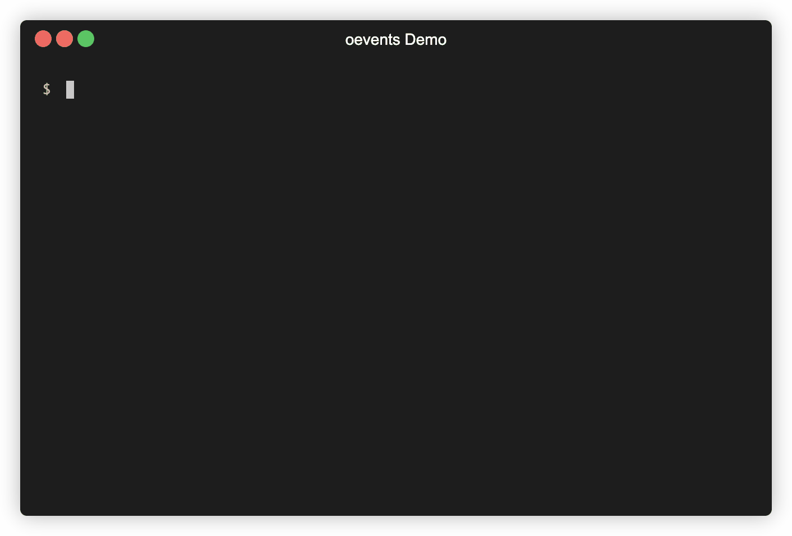

# oevents
`oevents` is a command line interface (CLI) tool for loading exported Optimizely's Enriched Events Export.

Optimizely [Enriched Events Export](https://docs.developers.optimizely.com/optimizely-data/docs/enriched-events-export) gives you secure access to your Optimizely event data so you can analyze your experiment results with greater flexibility. The export includes a useful combination of events attributes:

- Raw metadata (event names, user IDs, etc) that you pass to Optimizely, without additional processing
- Enriched metadata that Optimizely adds such as experiment IDs, variation IDs, and session IDs

For more information, see the Enriched Events [data specification](https://docs.developers.optimizely.com/optimizely-data/docs/enriched-events-data-specification).

Demo of using `oevents`:



## Prerequisites: bash (v4+), date, jq, curl, and aws

`oevents` is written in [bash](https://www.gnu.org/software/bash/) and should run on OS X and most GNU/Linux distributions.  You'll need to install the following prerequisites:

- [jq](https://stedolan.github.io/jq/)
- [curl](https://curl.haxx.se/)  (Note: All versions of OS X starting with Jaguar come with curl installed)
- the [Amazon AWS CLI](https://aws.amazon.com/cli/) (v2+) 

## Downloading `oevents`

You can download a zipped directory containing the `oevents` CLI [here](https://library.optimizely.com/labs/artifacts/optimizely-data-cli/optimizely-data-cli.zip).

`oevents` lives in the  [Optimizely Labs Github repository](https://github.com/optimizely/labs/tree/master/labs/optimizely-data-cli).  You can also access it by cloning the repository or downloading the `oevents` script directly from the Github web interface.

## Installation

1. Clone this repository

2. Make `oevents` executable:

`oevents` is a bash script. To run it, you'll need to make sure it's executable.  Assuming `oevents` is in your working directory, you can do this with the following command:

```sh
$ chmod +x oevents
```

To run `oevents`, you can specify the script's path explicitly like this (again, assuming `oevents` is in your working directory):

```sh
$ ./oevents help
```

Or you can add it to a directory in your `PATH` environment variable.  

```sh
$ sudo cp oevents /usr/local/bin/
$ oevents help
```

## Get Help

For usage instructions, use the `help` command:

```sh
$ oevents help
```

## Authenticating

Enriched Event data is served via [Amazon S3](https://aws.amazon.com/s3/).  You can authenticate `oevents` to AWS in two ways:

### Option 1: (Recommended) Using an Optimizely Personal Access Token
Provide your [Optimizely Personal Access Token](https://docs.developers.optimizely.com/web/docs/personal-token) via the `OPTIMIZELY_API_TOKEN` environment variable or the `--token` command line argument. `oevents` will acquire AWS credentials using the [Optimizely Authentication API](https://docs.developers.optimizely.com/optimizely-data/docs/authentication-api).

```sh
  $ oevents auth --token <optimizely personal access token>

  export AWS_ACCESS_KEY_ID=<key id>
  export AWS_SECRET_ACCESS_KEY=<secret access key>
  export AWS_SESSION_TOKEN=<session token>
  export AWS_SESSION_EXPIRATION=1594953226000
  export S3_BASE_PATH=s3://optimizely-events-data/v1/account_id=12345/
```

Copy and paste the above export commands into your terminal. Then go to the start exploring your enriched event data in the [next section](#exploring-your-enriched-event-data).

**Note:** You can also use the above temporary AWS credentials directly with the AWS CLI or client libraries in your ETL pipeline.

### Option 2: Providing AWS Credentials Directly
You can also authenticate by providing your AWS credentials directly. See the [AWS user guide](https://docs.aws.amazon.com/cli/latest/userguide/cli-configure-files.html) for instructions.


## Exploring your Enriched Event data

[decisions]: https://docs.developers.optimizely.com/web/docs/enriched-events-export#section-decisions
[conversions]: https://docs.developers.optimizely.com/web/docs/enriched-events-export#section-conversions

Enriched Events are partitioned into two top-level datasets, [decisions] (`type=decisions`) and [conversions] (`type=events`).  Each of these datasets is partitioned by date and experiment (for decisions) or event type (for conversions).

You can use `oevents ls` to list all of the experiments that produced decision data on a given date:

```sh
$ oevents ls --type decisions --date 2020-05-10

                           PRE experiment=10676850402/
                           PRE experiment=14386840295/
                           PRE experiment=14821050982/
                           PRE experiment=15117030650/
                           PRE experiment=17517981213/
                           PRE experiment=17535310125/
                           PRE experiment=8997901009/
```

You can also use `oevents` to list all of the event types collected on a given day:

```sh
$ oevents ls --type events --date 2020-05-10

                           PRE event=search_query/
                           PRE event=search_results_click/
                           PRE event=add_to_cart/
                           PRE event=purchase/
```

## Downloading your Enriched Event data

You can use `oevents load` to download your Enriched Event data in [Apache Parquet](https://parquet.apache.org/) format.  Command line arguments can be used to specify a progressively narrower subset of your data.

To download *all* enriched event data associated with your Optimizely account:

```sh
$ oevents load --output ~/optimizely_data
```

To download all [decision](decisions) data associated with your Optimizely account:

```sh
$ oevents load \
    --type decisions \
    --output ~/optimizely_data
```

To download all [decision](decisions) data collected between July 1st and 5th, 2020:

```sh
$ oevents load \
    --type decisions \
    --start 2020-07-01 \
    --end 2020-07-05 \
    --output ~/optimizely_data
```

To download all [decision](decisions) data for experiment `12345` collected between July 1st and 5th, 2020:

```sh
$ oevents load \
    --type decisions \
    --start 2020-07-01 \
    --end 2020-07-05 \
    --experiment 12345 \
    --output ~/optimizely_data
```

## Testing `oevents`

You can run the `oevents` test suite by install [BATS](https://github.com/bats-core/bats-core) and running `test.bats` in this directory.  Note: the `oevents` test suite requires bash v4.4+.
